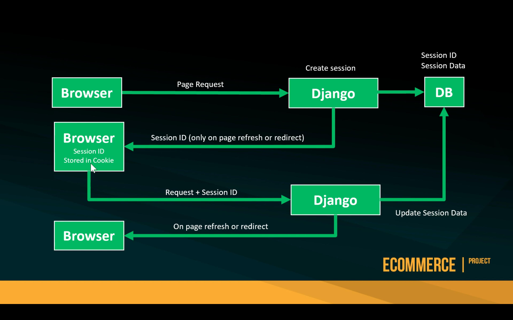
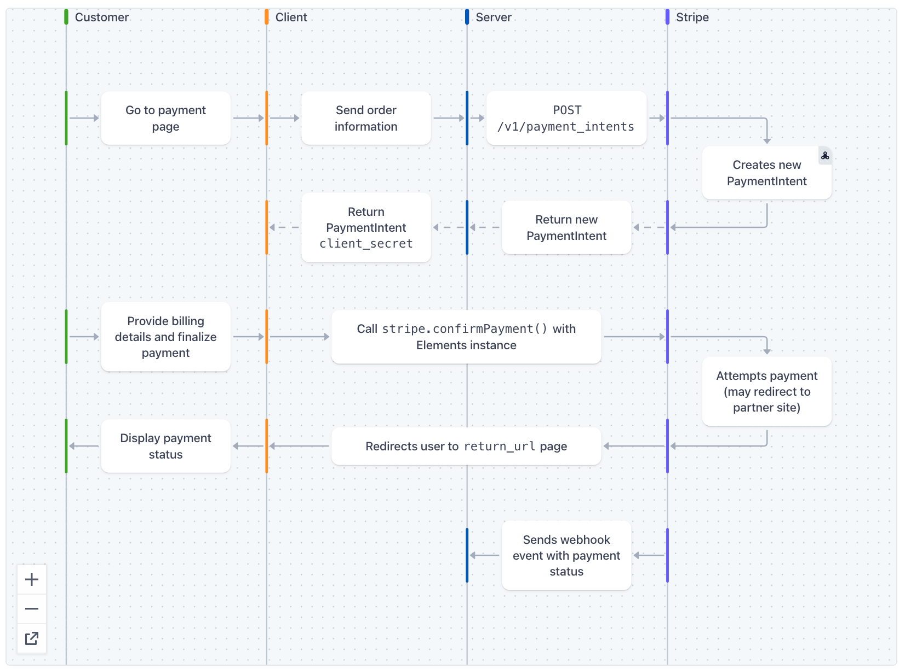

### Ecommerce Store (2021) - Part 1: Building models, views and testing

<details><summary style="font-size:18px;color:Orange;text-align:left">How to start the most basic Django project?</summary>

1. Create & activate the environment

    - `$ conda create -n django-env python=3.8 -y` → Create a environment with the given name, env_name
    - `$ cae django-env`
    - `$ pip install django` → install django in the activated conda environment.
    - `$ pip3 install -r requirements.txt` → Install the packages from 'requirment.txt' file if you have any.

2. Make the Directory where Django project will be created

    - `$ mkdir bookstore`

3. `cd` into the newly created directory

    - `$ cd bookstore`

4. Create the Django project in the current Directory

    - `$ django-admin startproject core .`

5. Run the Django Server:

    - `$ python manage.py runserver localhost:8000`

6. Now checkout the `localhost:8000`

    - Observation:
        - The pre-built Django home page is rendered.

7. How to stop the Django Server:

    - `$ ^ + c` #
    - `$ ps -ax | grep 'python manage.py runserver'` # Find the Django `runserver` process.
    - `$ kill <PID>` # to kill django `runserver` process by process ID.

8. Migrate Data:

    - `$ python manage.py makemigrations`
        - The `makemigrations` command looks at all your available models and creates migrations for whichever tables don’t already exist. `migrate` runs the migrations and creates tables in your database, as well as optionally providing much richer schema control.
        - By running makemigrations, you’re telling Django that you’ve made some changes to your models and that you’d like the changes to be stored as a migration.
        - `makemigrations` command create a file under `app_name/migrations/` with the database structure to create
    - `$ python manage.py migrate`
        - `migrate`: The migrate command takes all the migrations that haven’t been applied (Django tracks which ones are applied using a special table in your database called django_migrations) and runs them against your database - essentially, synchronizing the changes you made to your models with the schema in the database.
    - Observations:
        - the `db.sqlite3` file is created.
        - The data is stored in the database.

9. Create a superuser:

    - `$ python manage.py createsuperuser`→ Create admin user.
        ```yaml
        # Created admin user with following credentials:
        username: a.momin
        password: 1111
        email: a.momin.nyc@gmail.com
        ```
    - Open the Database (db.sqlite3) file with SQLITE EXPLORER (a VSCode Tool)
    - Observations:
        - The data is stored in the database.

10. Checkout Django admin page at `localhost:8000/admin/`
    - Notes:
        - Forgetting the "/" at the end of `localhost:8000/admin/` may cause error.
    - Observation:
        - The default login page is rendered.
    - Login using the super user credentials from the last step.
    - Logout clicking the `logout` button on the home admin page.

</details>
<details>
<summary style="font-size:18px;color:Orange;text-align:left">How to Create and Start a Django App?</summary>

-   Notes:

    -   In the context of web development using the Django framework, a project refers to a collection of settings, configurations, and apps that make up a complete web application. An app, on the other hand, refers to a self-contained module that performs a specific function within the project.
    -   A Django project typically consists of multiple apps that work together to create a cohesive web application. Each app focuses on a specific feature or functionality of the web application, such as user authentication, database management, or content management.

0. Create a Django App by the name of `store`.

    - `$ python manage.py startapp store`

1. Register the newly created App by appending it's name into `INSTALLED_APPS` as follows.

    ```python
    # core/settings.py
    INSTALLED_APPS = [
        ...,
        'store',
    ]
    ```

2. Create models of your store [10:46 - ]

    ```python
    # store/models.py
    from django.contrib.auth.models import User
    from django.db import models
    from django.urls import reverse

    class ProductManager(models.Manager):
        ...

    class Category(models.Model):
        ...

    class Product(models.Model):
        ...
    ```

3. Create & config Media Folder [31:41 - 36:26]

    - For image to be loaded, we need to create the media folder and configure it.

    - `$ mkdir media`
    - Update the projects's setting file (core/settings.py)

        ```python
        # core/settings.py
        MEDIA_URL = '/media/'
        MEDIA_ROOT = os.path.join(BASE_DIR, 'media/')
        ...
        ```

4. Update your root level URLConf including the url for the `store` app.

    ```python
    # core/urls.py
    from django.conf import settings
    from django.conf.urls.static import static

    urlpatterns = [
        ...,
        path('', include('store.urls', namespace='store')),
    ]

    if settings.DEBUG:
        urlpatterns += static(settings.MEDIA_URL, document_root = settings.MEDIA_ROOT)
    ```

5. Define the urls for the app

    ```python
    # store/urls.py
    from django.urls import path
    from . import views

    app_name = 'store'

    urlpatterns = [
        path('', views.product_all, name='product_all'),
        path('<slug:slug>', views.product_detail, name='product_detail'),
        path('shop/<slug:category_slug>/', views.category_list, name='category_list'),
    ]
    ```

6. Register custom models to Django's Admin features

    ```python
    # store/admin.py
    from django.contrib import admin
    from .models import Category, Product

    @admin.register(Category)
    class CategoryAdmin(admin.ModelAdmin):
        ...

    @admin.register(Product)
    class ProductAdmin(admin.ModelAdmin):
        ...
    ```

7. Create Views [01:19:16]

    ```python
    # store/views.py
    from django.shortcuts import get_object_or_404, render
    from .models import Category, Product

    def product_all(request):
        products = Product.products.all()
        return render(request, 'store/home.html', {'products': products})

    def category_list(request, category_slug=None):
        ...

    def product_detail(request, slug):
        ...
    ```

8. Create and Register a Context Processor Function. [01:38:36]

    ```python
    # store/context_processors.py
    from .models import Category

    def categories(request):
        return {
            'categories': Category.objects.all()
        }
    ```

    - Register the Context Processor in Settings: Add the path to your context processor function to the context_processors option in the TEMPLATES setting.

    ```python
    # core/settings.py
    TEMPLATES = [
        {
            ...,
            'OPTIONS': {
                'context_processors': [
                    ...,
                    'store.context_processors.categories'
                ],
            },
        },
    ]
    ```

9. Configure TEMPLATES Setting.

    ```python
    # core/settings.py
    TEMPLATES = [
        {
            ...,
            'DIRS': [BASE_DIR/'templates'],
            ...,
        },
    ]
    ```

10. Create Templates

    - Create the base template (`templates/store/base.html`).
    - Create the home template.

        ```html
        <!-- templates/store/home.html  -->

        

        <div class="col">
            <div class="card shadow-sm">
                
                <div class="card-body">
                    <p class="card-text">
                        <a
                            class="text-dark text-decoration-none"
                            href="{{ product.get_absolute_url }}"
                            >{{ product.title }}</a
                        >
                    </p>
                    <div
                        class="d-flex justify-content-between align-items-center"
                    >
                        <small class="text-muted">9min read</small>
                    </div>
                </div>
            </div>
        </div>

        
        ```

11. Migrate Data

    - `$ python manage.py makemigrations`
        - The `makemigrations` command looks at all your available models and creates migrations for whichever tables don’t already exist. `migrate` runs the migrations and creates tables in your database, as well as optionally providing much richer schema control.
        - By running makemigrations, you’re telling Django that you’ve made some changes to your models and that you’d like the changes to be stored as a migration.
        - makemigrations Create a file under `app_name/migrations/` with the database structure to create
    - `$ python manage.py migrate`

        - `migrate`: The migrate command takes all the migrations that haven’t been applied (Django tracks which ones are applied using a special table in your database called django_migrations) and runs them against your database - essentially, synchronizing the changes you made to your models with the schema in the database.

        - Data is migrated into the database.

12. Create `Fixtures` and upload data into your app.

    - `$ mkdir store/fixtures` → Make 'fixtures' directory
    - `$ touch store/fixtures/categories.json` → Create a fixture by the name of 'categories'.
    - `$ touch store/fixtures/books.json` → Create a fixture by the name of 'books'.
    - `$ python manage.py loaddata categories.json` → Load the categories fixture into the app
    - `$ python manage.py loaddata books.json` → Load the books fixture into the app

13. Check connection using `telnet`/`curl` (Optional)

    - `$ curl -v localhost:8010`
    - `$ telnet localhost 8000`
        ```txt
        Trying ::1...
        telnet: connect to address ::1: Connection refused
        Trying 127.0.0.1...
        Connected to localhost.
        Escape character is '^]'.
        ======= THEN TYPE: =======
        GET / HTTP/1.0
        Host: localhost
        ```

14. [How to install Django Debugger Tool](https://django-debug-toolbar.readthedocs.io/en/latest/installation.html#installation)

</details>

---

### Ecommerce Store (2021) - Part 2: Basket with session handling

<details><summary style="font-size:18px;color:Orange;text-align:left">How to set up and use Session</summary>



-   [How to use sessions](https://docs.djangoproject.com/en/4.1/topics/http/sessions/)

    -   Django provides full support for anonymous sessions. The session framework lets you store and retrieve arbitrary data on a per-site-visitor basis. It stores data on the server side and abstracts the sending and receiving of cookies. Cookies contain a session ID – not the data itself (unless you’re using the cookie based backend).

    -   Enabling sessions

        -   Sessions are implemented via a piece of middleware.

    -   To enable session functionality, do the following:

        -   Edit the MIDDLEWARE setting and make sure it contains `django.contrib.sessions.middleware.SessionMiddleware`. The default `settings.py` created by django-admin startproject has `SessionMiddleware` activated.
        -   If you don’t want to use sessions, you might as well remove the SessionMiddleware line from MIDDLEWARE and `django.contrib.sessions` from your INSTALLED_APPS. It’ll save you a small bit of overhead.

    -   Configuring the session engine

        -   By default, Django stores sessions in your database (using the model `django.contrib.sessions.models.Session`). Though this is convenient, in some setups it’s faster to store session data elsewhere, so Django can be configured to store session data on your filesystem or in your cache.

    -   Using database-backed sessions

        -   If you want to use a database-backed session, you need to add 'django.contrib.sessions' to your INSTALLED_APPS setting.

    -   Once you have configured your installation, run manage.py migrate to install the single database table that stores session data.

1.  Create a new `basket` App.

    -   `$ python manage.py startapp basket` → Create a Django App by the name of `basket`

2.  Register the `basket` app by appending it's name into `INSTALLED_APPS` as follows.

    ```python
    # core/settings.py
    INSTALLED_APPS = [
        ...,
        'basket',
        ...,
    ]
    ```

3.  Add the `/basket` URL-namespcace into the urlpattern at the root level of URLConf.

    ```python
    # core/urls.py
    from django.conf import settings
    from django.conf.urls.static import static

    urlpatterns = [
        ...,
        path('basket/', include('basket.urls', namespace='basket')),
    ]
    ```

    ```python
    # basket/urls.py
    from django.urls import path
    from . import views

    app_name = 'basket'

    urlpatterns = [
        path('', views.basket_summary, name='basket_summary'),
        path('add/', views.basket_add, name='basket_add'),
        path('delete/', views.basket_delete, name='basket_delete'),
        path('update/', views.basket_update, name='basket_update')
    ]
    ```

4.  Create `Basket` object:

    ```python
    # basket/basket.py
    from decimal import Decimal
    from store.models import Product


    class Basket():
        def __init__(self, request):
            pass

        def add(self, product, qty):
            pass

        def __iter__(self):
            pass

        def __len__(self):
            pass

        def save(salf):
            pass

        def update(self, product, qty):
            pass

        def delete(self, product):
            pass

        def get_total_price(self):
            pass
    ```

5.  Create and register a context processor:

    ```python
    # basket/context_processors.py
    from .basket import Basket

    def basket(request):
        return {'basket': Basket(request)}
    ```

    ```python
    # core/settings.py
    TEMPLATES = [
        {
            ...,
            'OPTIONS': {
                'context_processors': [
                    ...,
                    'basket.context_processors.basket'
                ],
            },
        },
    ]
    ```

6.  Create the viewes for the app

    ```python
    # basket/views.py
    from django.http import JsonResponse
    from django.shortcuts import get_object_or_404, render
    from store.models import Product
    from .basket import Basket

    def basket_summary(request):
        pass

    def basket_add(request):
        pass

    def basket_delete(request):
        pass

    def basket_update(request):
        pass
    ```

7.  Create the template (`templates/basket/summary.html`)

    ```html
    <!-- templates/basket/summary.html -->

    ...

    <script>
        $(document).on("click", ".delete-button", function (e) {
            ...
        });

        $(document).on("click", ".update-button", function (e) {
            ...
        });
    </script>
    ```

8.  update `templates/store/products/single.html`

    ```html
    <!-- templates/store/products/single.html -->
    ...

    <script>
        $(document).on("click", "#add-button", function (e) {
            ...
        });
    </script>
    ```

    </details>

---

### Ecommerce Store (2021) - Part 3: Build a user, payment and order management system

-   [Youtube](https://www.youtube.com/watch?v=ncsCnC3Ynlw&list=PLOLrQ9Pn6caxY4Q1U9RjO1bulQp5NDYS_&index=3&t=3956s)

<details>
<summary style="font-size:18px;color:Orange;text-align:left">Implement a registration system using a form build from scratch.</summary>

1. Start the `account` app.

    - `$ python manage.py startapp account`

2. Create custom user (UserBase) and custom manager (CustomAccountManager) model.

    ```python
    # account/models.py
    class CustomAccountManager(BaseUserManager):

        def create_superuser(self, email, user_name, password, **other_fields):
            pass
        def create_user(self, email, user_name, password, **other_fields):
            pass


    class UserBase(AbstractBaseUser, PermissionsMixin):
        ...
        objects = CustomAccountManager()
    ```

3. Resister the custom user with the admin site.

    ```python
    from django.contrib import admin
    from .models import UserBase

    admin.site.register(UserBase)
    ```

4. Register the app and add the `AUTH_USER_MODEL` parameter to the settings(`core/settings.py`).

    ```python
    # core/settings.py
    INSTALLED_APPS = [
    ...
    'account',
    ]
    ...
    AUTH_USER_MODEL = 'account.UserBase'
    ...
    ```

5. Update product model in the store app.

    ```python
    # store/models.py
    class Product(models.Model):
        ...
        created_by = models.ForeignKey(settings.AUTH_USER_MODEL, related_name='product_creator', on_delete=models.CASCADE)
        ...
    ```

6. Update project urls and create the app urls.

    ```python
    # core/urls.py
    urlpatterns = [
        ...,
        path('account/', include('account.urls', namespace='account')),
    ]
    ```

    ```python
    # account/urls.py
    app_name = 'account'
    urlpatterns = [
        path('dashboard/', views.dashboard, name='dashboard'),
        path('register/', views.account_register, name='register'),
        path('activate/<slug:uidb64>/<slug:token>/', views.account_activate, name='activate'),
    ]
    ```

7. Create the registration model form.

    ```python
    # account/forms.py
    class RegistrationForm(forms.ModelForm):

        user_name = forms.CharField(label='Enter Username', min_length=4, max_length=50, help_text='Required')
        email = forms.EmailField(max_length=100, help_text='Required', error_messages={'required': 'Sorry, you will need an email'})
        password = forms.CharField(label='Password', widget=forms.PasswordInput)
        password2 = forms.CharField(label='Repeat password', widget=forms.PasswordInput)

        class Meta:
            model = UserBase
            fields = ('user_name', 'email',)

        def clean_user_name(self):
            pass
        def clean_password2(self):
            pass
        def clean_email(self):
            pass

        def __init__(self, *args, **kwargs):
            super().__init__(*args, **kwargs)
            self.fields['user_name'].widget.attrs.update({'class': 'form-control mb-3', 'placeholder': 'Username'})
            self.fields['email'].widget.attrs.update({'class': 'form-control mb-3', 'placeholder': 'E-mail', 'name': 'email', 'id': 'id_email'})
            self.fields['password'].widget.attrs.update({'class': 'form-control mb-3', 'placeholder': 'Password'})
            self.fields['password2'].widget.attrs.update({'class': 'form-control', 'placeholder': 'Repeat Password'})
    ```

8. Create a Token object.

    ```python
    # account/token.py
    from django.contrib.auth.tokens import PasswordResetTokenGenerator
    from six import text_type

    class AccountActivationTokenGenerator(PasswordResetTokenGenerator):
        def _make_hash_value(self, user, timestamp):
            pass

    account_activation_token = AccountActivationTokenGenerator()
    ```

9. Create the account views.

    ```python
    @login_required
    def dashboard(request):
        return render(request, 'account/user/dashboard.html')

    # account/views.py
    def account_register(request):
        pass
    def account_activate(request, uidb64, token):
        pass
    ```

10. Set `EMAIL_BACKEND` parameter

    - The `EMAIL_BACKEND` parameter is used to specify the email delivery backend that should be used by the application for sending emails.
    - By default, Django uses the SMTP backend, which is a simple email backend that sends email messages using the Simple Mail Transfer Protocol (SMTP). However, Django provides a variety of other email backends that can be used depending on your application's requirements.
    - For example, if you want to use the console backend for testing and development purposes, you can define the EMAIL_BACKEND setting like this:

    ```python
    # core/settings.py
    ...
    EMAIL_BACKEND = 'django.core.mail.backends.console.EmailBackend'
    ```

11. Create the registration Templates

    - create `templates/account/user/dashboard.html`
    - create `templates/account/registration/register.html`
    - create `templates/account/registration/account_activation_email.html`
    - create `templates/account/registration/activation_invalid.html`

12. Test the `account/register/` routes:
    - Checkout:
        - `account/register/`
        - `account/'activate/<slug:uidb64>/<slug:token>/'`
        -

</details>

<details>
<summary style="font-size:18px;color:Orange;text-align:left">Implement the login & logout system</summary>

0.  Create the login URL using built-in Classed-based views.

    ```python
    # account/urls.py
    urlpatterns = [
        ...
        path('login/', auth_views.LoginView.as_view(template_name='account/registration/login.html', form_class=UserLoginForm), name='login'),
    ]
    ```

1.  Add the following setting parameters into setting file.

    -   The `LOGIN_REDIRECT_URL` parameter is used to specify the URL where the user should be redirected after they have successfully logged in.
    -   The `LOGIN_URL` parameter is used to specify the URL where the user should be redirected if they try to access a protected resource without being authenticated.

    ```python
    # core/setting.py
    ...
    LOGIN_REDIRECT_URL = '/account/dashboard'
    LOGIN_URL = '/account/login/'
    ```

2.  Create the user login model form.

    ```python
    # account/forms.py
    class UserLoginForm(AuthenticationForm):
        username = forms.CharField(widget=forms.TextInput(attrs={'class': 'form-control mb-3', 'placeholder': 'Username', 'id': 'login-username'}))
        password = forms.CharField(widget=forms.PasswordInput(attrs={'class': 'form-control', 'placeholder': 'Password', 'id': 'login-pwd',}))
    ```

3.  Create the login template (`template/accoint/registration/login.html`)

4.  Assign the login url with the login button on base template (`template/store/base.html`)

    ```html
    <!-- template/store/base.html -->
    ...

    <a
        type="button"
        role="button"
        href=""
        class="btn btn-outline-secondary border-0 basket-btn"
    >
        <div>
            <svg
                xmlns="http://www.w3.org/2000/svg"
                width="22"
                height="22"
                fill="currentColor"
                class="bi bi-door-closed"
                viewBox="0 0 16 16"
            >
                <path
                    d="M3 2a1 1 0 0 1 1-1h8a1 1 0 0 1 1 1v13h1.5a.5.5 0 0 1 0 1h-13a.5.5 0 0 1 0-1H3V2zm1 13h8V2H4v13z"
                />
                <path d="M9 9a1 1 0 1 0 2 0 1 1 0 0 0-2 0z" />
            </svg>
        </div>
        <span class="fs15 fw500">Login</span>
    </a>
    ```

5.  Link the login url with the `Already have an account?` button on register template (`template/account/register.html`)

6.  Create the logout URL using built-in Classed-based views

    ````python
    # account/urls.py
    urlpatterns = [
        ...
        path('logout/', auth_views.LogoutView.as_view(next_page='/account/login/'), name='logout'),
    ]
    ```
    ````

</details>

<details>
<summary style="font-size:18px;color:Orange;text-align:left">How to edit, and delete user account?</summary>

0. Update `account/user/dashboard.html`
1. Assign the dashboard url with the account button on base template (`template/store/base.html`)
2. Create url for edit-details:

    ```python
    # account/urls.py
    urlpatterns = [
        ...
        path('profile/edit/', views.edit_details, name='edit_details'),
    ]
    ```

3. Create the model form for edit-details.

    ```python
    # account/forms.py
    class UserEditForm(forms.ModelForm):
        email = forms.EmailField(label='Account email (can not be changed)',max_length=200,widget=forms.TextInput(attrs={'class': 'form-control mb-3', 'placeholder': 'email', 'id': 'form-email', 'readonly': 'readonly'}))
        user_name = forms.CharField(label='Firstname',min_length=4,max_length=50,widget=forms.TextInput(attrs={'class': 'form-control mb-3', 'placeholder': 'Username', 'id': 'form-firstname', 'readonly': 'readonly'}))
        first_name = forms.CharField(label='Username',min_length=4,max_length=50,widget=forms.TextInput(attrs={'class': 'form-control mb-3', 'placeholder': 'Firstname', 'id': 'form-lastname'}))
        ...
    ```

4. Define the view for edit-details.

    ```python
    # account/views.py
    @login_required
    def edit_details(request):
        pass
    ```

5. Create `template/user/edit_details.html` template

6. Attach `template/user/edit_details.html` with `Change Details` link into dashboard template (`template/account/user/dashboard.html`).

7. Create url for delete-user

    ```python
    # account/urls.py
    urlpatterns = [
        ...
        path('profile/delete_user/', views.delete_user, name='delete_user'),
        path('profile/delete_confirm/', TemplateView.as_view(template_name="account/user/delete_confirm.html"), name='delete_confirmation'),
    ]
    ```

8. Define the view for delete user.

    ```python
    # account/views.py
    @login_required
    def delete_user(request):
        user = UserBase.objects.get(user_name=request.user)
        user.is_active = False
        user.save()
        logout(request)
        return redirect('account:delete_confirmation')
    ```

9. Update `template/user/edit_details.html` template.

    - Assign the delete url to the delete form.

        ```html
        <!-- template/user/edit_details.html -->
        ...

        <form
            class="account-form px-4"
            action=""
            method="post"
        >
            
            <p class=" h3 pt-4 font-weight-bold">Delete Account</p>
            <p>Are you sure you want to delete your account?</p>
            <button
                type="submit"
                role="button"
                class="btn btn-danger btn-block py-2 mb-4 mt-5 fw-bold w-100"
            >
                Delete
            </button>
        </form>
        ```

    - Notes:
        - How two forms from the same template can be submitted into two different routes.

10. Create `account/user/delete_confirm.html` template.

 </details>

<details>
<summary style="font-size:18px;color:Orange;text-align:left">How to reset user account?</summary>

0. Create urls for password reset using class-based views

    ```python
    # account/urls.py
    urlpatterns = [
        ...
        path(
            'password_reset/',
            auth_views.PasswordResetView.as_view(
                template_name="account/user/password_reset_form.html",
                success_url='password_reset_email_confirm',
                email_template_name='account/user/password_reset_email.html',
                form_class=PwdResetForm),
            name='password_reset'
        ),
        path(
            'password_reset/password_reset_email_confirm/',
            TemplateView.as_view(template_name="account/user/reset_status.html"),
            name='password_reset_done'),
        path(
            'password_reset_confirm/<uidb64>/<token>',
            auth_views.PasswordResetConfirmView.as_view(
                template_name='account/user/password_reset_confirm.html',
                success_url='/account/password_reset_complete/',
                form_class=PwdResetConfirmForm),
            name="password_reset_confirm"
        ),
        path(
            'password_reset_complete/',
            TemplateView.as_view(template_name="account/user/reset_status.html"),
            name='password_reset_complete'),
    ]
    ```

1. Create the Model forms for resetting passwords.

    ```py
    # account/forms.py
    class PwdResetForm(PasswordResetForm):

        email = forms.EmailField(
            max_length=254,
            widget=forms.TextInput(attrs={'class': 'form-control mb-3', 'placeholder': 'Email', 'id': 'form-email'}))

        def clean_email(self):
            email = self.cleaned_data['email']
            u = UserBase.objects.filter(email=email)
            if not u:
                raise forms.ValidationError(
                    'Unfortunatley we can not find that email address')
            return email


    class PwdResetConfirmForm(SetPasswordForm):
        new_password1 = forms.CharField(
            label='New password',
            widget=forms.PasswordInput(attrs={'class': 'form-control mb-3', 'placeholder': 'New Password', 'id': 'form-newpass'}))
        new_password2 = forms.CharField(
            label='Repeat password',
            widget=forms.PasswordInput(attrs={'class': 'form-control mb-3', 'placeholder': 'New Password', 'id': 'form-new-pass2'}))

    ```

2. Create the password-reset-related templates.

    - `templates/account/user/password_reset_confirm.html`
    - `templates/account/user/password_reset_email.html`
    - `templates/account/user/password_reset_form.html`
    - `templates/account/user/password_reset_status.html`

3. Update `template/account/user/login.html` template

    - Add `Forgotten Password?` link to the login page.

    ```html
    <!-- template/account/user/login.html -->
    ...
    <p class="small text-center pt-4">
        <a href="">Forgotten Password?</a>
    </p>
    ```

</details>

<details><summary style="font-size:18px;color:Orange;text-align:left">Cinfigure payment system with Stripe</summary>

-   [Stripe: Accept a payment](https://stripe.com/docs/payments/accept-a-payment?platform=web&ui=elements)
-   
-   [install stripe-cli](https://stripe.com/docs/stripe-cli)

    -   `$ brew install stripe/stripe-cli/stripe`

-   Credit Card Number Provided by Stripe for Testing Payment:
    -   No Auth: 4242424242424242
    -   Auth: 4000002500003155
    -   Error: 4000000000009995

1. Create and register the payment app.

    - `$ python manage.py startapp payment`

    ```python
    # core/settings.py
    INSTALLED_APPS = [
    ...
    'payment',
    ]
    ```

2. Create the urls for the app

    ```python
    # core/urls.py
    ...
    path('payment/', include('payment.urls', namespace='payment')),
    ...
    ```

    ```python
    # payment/urls.py
    from django.urls import path
    from . import views

    app_name = 'payment'

    urlpatterns = [
        path('', views.BasketView, name='basket'),
        path('orderplaced/', views.order_placed, name='order_placed'),
    ]
    ```

3. link the 'basket' url with busket-summary page.

    ```html
    <!-- /templates/basket/summary.html -->
    ...

    <a
        role="button"
        href=""
        class="btn btn-success fw-bold"
        type="button"
        >Checkout</a
    >
    ```

4. Create Views for payment app.

    ```python
    # payment/views.py
    @login_required
    def BasketView(request):

        basket = Basket(request)
        total = str(basket.get_total_price())
        total = total.replace('.', '')
        total = int(total)

        stripe.api_key = settings.STRIPE_SECRET_KEY
        intent = stripe.PaymentIntent.create(
            amount=total,
            currency='gbp',
            metadata={'userid': request.user.id}
        )

        return render(request, 'payment/home.html', {'client_secret': intent.client_secret})


    def order_placed(request):
        basket = Basket(request)
        basket.clear()
        return render(request, 'payment/orderplaced.html')
    ```

5. Implement the `clear()` method in 'Basket' object

    ```python
    # basket/basket.py
    class Basket():
    """
    A base Basket class, providing some default behaviors that
    can be inherited or overrided, as necessary.
    """
    def __init__(self, request):
        self.session = request.session
        basket = self.session.get(settings.BASKET_SESSION_ID)
        if settings.BASKET_SESSION_ID not in request.session:
            basket = self.session[settings.BASKET_SESSION_ID] = {}
        self.basket = basket
    ...

    def clear(self):
        # Remove basket from session
        del self.session[settings.BASKET_SESSION_ID]
        self.save()
    ```

6. Add new parameters into the settings file.

    ```python
    BASKET_SESSION_ID = 'basket'
    STRIPE_SECRET_KEY = os.environ['STRIPE_SECRET_KEY']
    ```

7. Create the templates

    - `templates/payment/home.html`
    - `templates/payment/orderplaced.html`

</details>

<details open><summary style="font-size:18px;color:Orange;text-align:left">Configure Order App</summary>

-   Credit Card Number Provided by Stripe for Testing Payment:

    -   `No Auth`: 4242424242424242
    -   `Auth`: 4000002500003155
    -   `Error`: 4000000000009995

-   [Get started with the Stripe CLI](https://stripe.com/docs/stripe-cli)

    -   `$ brew install stripe/stripe-cli/stripe`

-   Log into your Stripe account and listen for stripe event using stripe cli

    -   `$ stripe login`
    -   `$ stripe listen`
    -   `$ stripe listen --forward-to localhost:8000/payment/webhook/`

0.  Create and register the orders app.

    -   `$ python manage.py startapp orders`

    ```python
    # core/settings.py
    INSTALLED_APPS = [
    ...
    'orders',
    ]
    ```

1.  Create the urls for the app

    ```python
    # core/urls.py
    ...
    path("orders/", include("orders.urls", namespace="orders")),
    ...
    ```

2.  Create the Models for orders app.

    ```python
    # orders/models.py
    class Order(models.Model):
        user = models.ForeignKey(settings.AUTH_USER_MODEL, on_delete=models.CASCADE, related_name='order_user')
        full_name = models.CharField(max_length=50)
        address1 = models.CharField(max_length=250)
        address2 = models.CharField(max_length=250)
        city = models.CharField(max_length=100)
        phone = models.CharField(max_length=100)
        post_code = models.CharField(max_length=20)
        created = models.DateTimeField(auto_now_add=True)
        updated = models.DateTimeField(auto_now=True)
        total_paid = models.DecimalField(max_digits=5, decimal_places=2)
        order_key = models.CharField(max_length=200)
        billing_status = models.BooleanField(default=False)

        class Meta:
            ordering = ('-created',)

        def __str__(self):
            return str(self.created)


    class OrderItem(models.Model):
        order = models.ForeignKey(Order, related_name='items', on_delete=models.CASCADE)
        product = models.ForeignKey(Product, related_name='order_items', on_delete=models.CASCADE)
        price = models.DecimalField(max_digits=5, decimal_places=2)
        quantity = models.PositiveIntegerField(default=1)

        def __str__(self):
            return str(self.id)
    ```

3.  Update the BasketView for payment app.

    ```python
    # payment/views.py
    @login_required
    def BasketView(request):

        basket = Basket(request)
        total = str(basket.get_total_price())
        total = total.replace('.', '')
        total = int(total)

        stripe.api_key = settings.STRIPE_SECRET_KEY
        intent = stripe.PaymentIntent.create(
            amount=total,
            currency='gbp',
            metadata={'userid': request.user.id}
        )

        return render(request, 'payment/payment_form.html', {'client_secret': intent.client_secret, 'STRIPE_PUBLISHABLE_KEY': os.environ.get('STRIPE_PUBLISHABLE_KEY')})

    ```

4.  Update the `index.js` for payment app

    ```js
    var stripe = Stripe(STRIPE_PUBLISHABLE_KEY);

    ...

    form.addEventListener('submit', function (ev) {
        ev.preventDefault();

        var custName = document.getElementById("custName").value;
        var custAdd = document.getElementById("custAdd").value;
        var custAdd2 = document.getElementById("custAdd2").value;
        var postCode = document.getElementById("postCode").value;


        $.ajax({
            type: "POST",
            url: 'http://127.0.0.1:8000/orders/add/',
            data: {
                order_key: clientsecret,
                csrfmiddlewaretoken: CSRF_TOKEN,
                action: "post",
            },
            success: function (json) {
                console.log(json.success)

                stripe.confirmCardPayment(clientsecret, {
                    payment_method: {
                        card: card,
                        billing_details: {
                            address: {
                                line1: custAdd,
                                line2: custAdd2
                            },
                            name: custName
                        },
                    }
                }).then(function (result) {
                    if (result.error) {
                        console.log('payment error')
                        console.log(result.error.message);
                    } else {
                        if (result.paymentIntent.status === 'succeeded') {
                            console.log('payment processed')
                            // There's a risk of the customer closing the window before callback
                            // execution. Set up a webhook or plugin to listen for the
                            // payment_intent.succeeded event that handles any business critical
                            // post-payment actions.
                            window.location.replace("http://127.0.0.1:8000/payment/orderplaced/");
                        }
                    }
                });

            },
            error: function (xhr, errmsg, err) { },
        });

    });

    ```

5.  Create the Order URL:

    ```python
    # orders/urls.py
    from django.urls import path
    from . import views

    app_name = 'orders'

    urlpatterns = [
        path('add/', views.add, name='add'),
    ]
    ```

6.  Define the views for orders app.

    ```python
    # orders/views.py

    def add(request):
        basket = Basket(request)
        if request.POST.get('action') == 'post':

            order_key = request.POST.get('order_key')
            user_id = request.user.id
            baskettotal = basket.get_total_price()

            # Check if order exists
            if Order.objects.filter(order_key=order_key).exists():
                pass
            else:
                order = Order.objects.create(user_id=user_id, full_name='name', address1='add1', address2='add2', total_paid=baskettotal, order_key=order_key)
                order_id = order.pk

                for item in basket:
                    OrderItem.objects.create(order_id=order_id, product=item['product'], price=item['price'], quantity=item['qty'])

            response = JsonResponse({'success': 'Return something'})
            return response


    def payment_confirmation(data):
        Order.objects.filter(order_key=data).update(billing_status=True)


    def user_orders(request):
        user_id = request.user.id
        orders = Order.objects.filter(user_id=user_id).filter(billing_status=True)
        return orders
    ```

7.  Integrate stripe webhook for payment app.

    ```python
    # payment/views.py
    # it listen the events sent from stripe.
    # Run: `$ stripe listen --forward-to localhost:8000/payment/webhook/` to listen events.
    @csrf_exempt
    def stripe_webhook(request):
        payload = request.body
        event = None

        try:
            event = stripe.Event.construct_from(json.loads(payload), stripe.api_key)
        except ValueError as e:
            print(e)
            return HttpResponse(status=400)

        # Handle the event
        if event.type == 'payment_intent.succeeded':
            payment_confirmation(event.data.object.client_secret)

        else:
            print('Unhandled event type {}'.format(event.type))

        return HttpResponse(status=200)

    def order_placed(request):
        ...
    ```

8.  Create the templates.

    -   `templates/payment/sub_base.html`
    -   `templates/payment/payment_form.html`

9.  Update the dashboard view of account app.

    ```python
    # account/views.py
    @login_required
    def dashboard(request):
        orders = user_orders(request)
        return render(request, 'account/user/dashboard.html', {'section': 'profile', 'orders': orders})
    ```

10. Update the `account/user/dashboard.html` templates.

11. Fix issues with total price in `basket.py`

    ```python
    # /basket/basket.py
    class Basket():
    """
    A base Basket class, providing some default behaviors that
    can be inherited or overrided, as necessary.
    """
        ...
        def get_subtotal_price(self):
            return sum(Decimal(item["price"]) * item["qty"] for item in self.basket.values())

        def get_total_price(self):

            subtotal = sum(Decimal(item["price"]) * item["qty"]
                        for item in self.basket.values())

            if subtotal == 0:
                shipping = Decimal(0.00)
            else:
                shipping = Decimal(11.50)

            total = subtotal + Decimal(shipping)
            return total
        ...
    ```

12. Redirect the stripe events to the given url.
    -   `$ stripe listen --forward-to localhost:8000/payment/webhook/`

</details>
